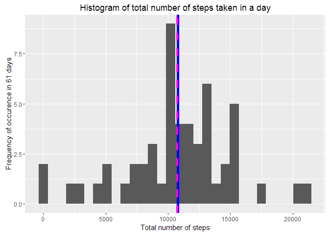
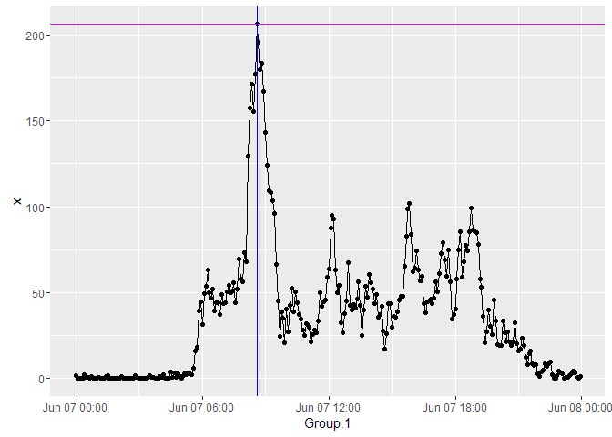
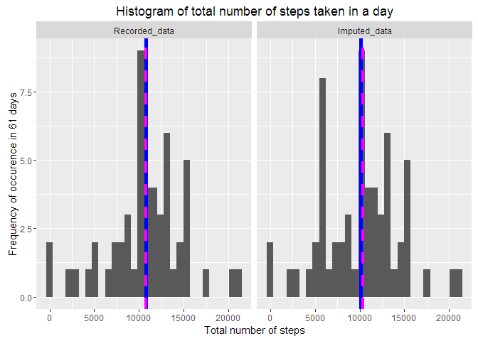
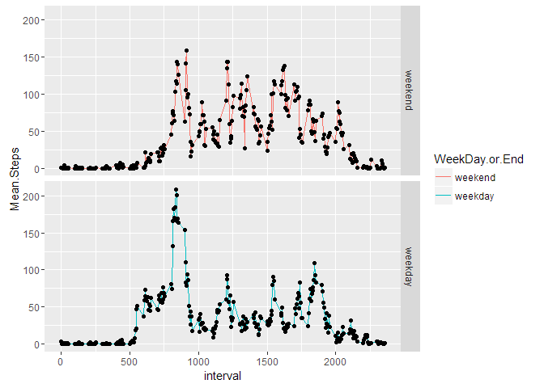

# Reproducible Research: Peer Assessment 1

###Reading and Processing Data  
The file that we have to use is (fortunately) a .csv file. We use the following code to read that into an object we'll use for raw data. We will also see the head and str to try to understand how the data is formatted.

```r
activity <- read.csv("C:/Users/admin/SkyDrive/Documents/Accademic/Coursera/Data Science/Reproducible Research/RR Assign 1/RepData_PeerAssessment1/activity.csv")
head(activity)
```

```
##   steps       date interval
## 1    NA 2012-10-01        0
## 2    NA 2012-10-01        5
## 3    NA 2012-10-01       10
## 4    NA 2012-10-01       15
## 5    NA 2012-10-01       20
## 6    NA 2012-10-01       25
```

```r
str(activity)
```

```
## 'data.frame':	17568 obs. of  3 variables:
##  $ steps   : int  NA NA NA NA NA NA NA NA NA NA ...
##  $ date    : Factor w/ 61 levels "2012-10-01","2012-10-02",..: 1 1 1 1 1 1 1 1 1 1 ...
##  $ interval: int  0 5 10 15 20 25 30 35 40 45 ...
```

We see that the dates are given as factors instead of date format. We shall convert the dates to the date format. As the format is in Year-Month-Day so we don't need to provide additional arguments to the as.Date function.

```r
activity$date <- as.Date(activity$date)
str(activity)
```

```
## 'data.frame':	17568 obs. of  3 variables:
##  $ steps   : int  NA NA NA NA NA NA NA NA NA NA ...
##  $ date    : Date, format: "2012-10-01" "2012-10-01" ...
##  $ interval: int  0 5 10 15 20 25 30 35 40 45 ...
```

Now that we have the dates we make the interval function more usable as well. For this we will be using the 'stringr' package. As the head clearly showed us the times are given in hour minutes format. However it doesn't contain the required number of 0's for the hour to be recognized. So we correct that with the wonderful stringr package.

```r
library(stringr)
activity$interval <- str_pad(activity$interval, 4, pad = "0")
head(activity)
```

```
##   steps       date interval
## 1    NA 2012-10-01     0000
## 2    NA 2012-10-01     0005
## 3    NA 2012-10-01     0010
## 4    NA 2012-10-01     0015
## 5    NA 2012-10-01     0020
## 6    NA 2012-10-01     0025
```

Now this is better. But it would still look better if we had a ':' in the middle.

```r
activity$interval <- gsub('^([0-9]{2})([0-5]+)$', '\\1:\\2', activity$interval)
head(activity)
```

```
##   steps       date interval
## 1    NA 2012-10-01    00:00
## 2    NA 2012-10-01    00:05
## 3    NA 2012-10-01    00:10
## 4    NA 2012-10-01    00:15
## 5    NA 2012-10-01    00:20
## 6    NA 2012-10-01    00:25
```

Much better. Now we combine the date and time to get a date time column. 

```r
activity$datetime <- paste(activity$date, activity$interval, sep = " ")
head(activity)
```

```
##   steps       date interval         datetime
## 1    NA 2012-10-01    00:00 2012-10-01 00:00
## 2    NA 2012-10-01    00:05 2012-10-01 00:05
## 3    NA 2012-10-01    00:10 2012-10-01 00:10
## 4    NA 2012-10-01    00:15 2012-10-01 00:15
## 5    NA 2012-10-01    00:20 2012-10-01 00:20
## 6    NA 2012-10-01    00:25 2012-10-01 00:25
```

Now using lubridate package we can make it the datetime column in it's namesake format.

```r
library(lubridate)
```

```
## 
## Attaching package: 'lubridate'
```

```
## The following object is masked from 'package:base':
## 
##     date
```

```r
activity$datetime <- ymd_hm (activity$datetime)
str(activity)
```

```
## 'data.frame':	17568 obs. of  4 variables:
##  $ steps   : int  NA NA NA NA NA NA NA NA NA NA ...
##  $ date    : Date, format: "2012-10-01" "2012-10-01" ...
##  $ interval: chr  "00:00" "00:05" "00:10" "00:15" ...
##  $ datetime: POSIXct, format: "2012-10-01 00:00:00" "2012-10-01 00:05:00" ...
```

Great! The date tine is in the POSIXct format. 

### What is mean total number of steps taken per day?
Considering that we have the date column with a unique date for each day, we can use that to aggregate our data into a new data.frame.

```r
rmnas <- is.na(activity$steps)
nalessactivity <- activity[!rmnas, ]
perday <- with(nalessactivity, aggregate(steps, by = list(date), FUN = sum))
str(perday)
```

```
## 'data.frame':	53 obs. of  2 variables:
##  $ Group.1: Date, format: "2012-10-02" "2012-10-03" ...
##  $ x      : int  126 11352 12116 13294 15420 11015 12811 9900 10304 17382 ...
```

Now we have that we can use the ggplot package to see how is the distribution of the steps taken in a day. We will add the mean and median in the same plot to see these items as well.

```r
library(ggplot2)
g <- ggplot(data = perday, aes(x))
mean <- mean(perday$x, na.rm = TRUE)
median <- median(perday$x, na.rm = TRUE)
g+geom_histogram(mapping = aes(x), na.rm = TRUE, bins = 30)+geom_vline(xintercept = mean, lwd = 2, col = "blue", show.legend = TRUE) + geom_vline(xintercept = median, lty=2, lwd=1.5, col="magenta", show.legend = TRUE) + labs(title = "Histogram of total number of steps taken in a day") + ylab("Frequency of occurence in 61 days") + xlab("Total number of steps") 
```

<!-- -->

We can see that the blue line shows the mean which has the value 1.0766189\times 10^{4} and the median of 10765 is shown by the magenta line.   

### What is the average daily activity pattern?
Considering that we have the interval column with a unique value for each 5 minute interval, we can use that to aggregate our data into a new data.frame. We will remove the NA values from the dataset.

```r
rmnas <- is.na(activity$steps)
nalessactivity <- activity[!rmnas, ]
perinterval <- with(nalessactivity, aggregate(steps, by = list(interval), FUN = mean))
perinterval$Group.1 <- strptime(perinterval$Group.1, format = "%H:%M")
summary(perinterval)
```

```
##     Group.1                          x          
##  Min.   :2016-06-07 00:00:00   Min.   :  0.000  
##  1st Qu.:2016-06-07 05:58:45   1st Qu.:  2.486  
##  Median :2016-06-07 11:57:30   Median : 34.113  
##  Mean   :2016-06-07 11:57:30   Mean   : 37.383  
##  3rd Qu.:2016-06-07 17:56:15   3rd Qu.: 52.835  
##  Max.   :2016-06-07 23:55:00   Max.   :206.170
```

We see that the dates are given as today's date but for the purpose of this time series we will not have an issue. We also need to know which interval has the maximum steps on average. 

```r
max <- max(perinterval$x)
maxtime <- perinterval[match(max, perinterval$x), 1]
```

Now we can plot the required time series graph. 

```r
ggplot(perinterval, aes(Group.1, x))+geom_point()+geom_line()+geom_hline(yintercept = max, col = "magenta")+geom_vline(xintercept = as.numeric(maxtime), col = "blue")
```

<!-- -->

The maximum average number of steps taken were 206.1698113 and if today was the average representative day it would be happening at the 5 interval identified by 2016-06-07 08:35:00 as can be seen from the magenta and blue line respectively.  

### Imputing missing values
As we saw before the NA values did create an issue. Ideally we would like to solve this issue by imputing values to the NA values. First let us see how many NA values are present in the interval column.


```r
toimpute <- is.na(activity$steps)
sum(toimpute)
```

```
## [1] 2304
```

So we can see that out of 17568 we have 2304 missing values a total of 13.1147541%. We see now that imputing needs to be done to a considerable degree. 

We shall try a novel approach to imputing where the same time from 7 same intervals before and after the date of the missing value will be chosen to provide us with the imputed value.  

```r
nactivity <- read.csv("C:/Users/admin/SkyDrive/Documents/Accademic/Coursera/Data Science/Reproducible Research/RR Assign 1/RepData_PeerAssessment1/activity.csv")
nactivity <- nactivity[order(nactivity$interval), ] 
nactivity$interval <- as.integer(nactivity$interval)
nactivity <- nactivity[,c(1, 3)]
nactivity <- as.matrix(nactivity)
str(nactivity)
```

```
##  int [1:17568, 1:2] NA 0 0 47 0 0 0 NA 0 34 ...
##  - attr(*, "dimnames")=List of 2
##   ..$ : chr [1:17568] "1" "289" "577" "865" ...
##   ..$ : chr [1:2] "steps" "interval"
```

```r
head(nactivity)
```

```
##      steps interval
## 1       NA        0
## 289      0        0
## 577      0        0
## 865     47        0
## 1153     0        0
## 1441     0        0
```

```r
library(impute)
nactivity <- impute.knn(as.matrix(nactivity, k = 14))
```

```
## Cluster size 17568 broken into 8784 8784 
## Cluster size 8784 broken into 4384 4400 
## Cluster size 4384 broken into 2196 2188 
## Cluster size 2196 broken into 1281 915 
## Done cluster 1281 
## Done cluster 915 
## Done cluster 2196 
## Cluster size 2188 broken into 0 2188 
## Done cluster 0 
## Cluster size 2188 broken into 1090 1098 
## Done cluster 1090 
## Done cluster 1098 
## Done cluster 2188 
## Done cluster 2188 
## Done cluster 4384 
## Cluster size 4400 broken into 2274 2126 
## Cluster size 2274 broken into 1997 277 
## Cluster size 1997 broken into 1199 798 
## Done cluster 1199 
## Done cluster 798 
## Done cluster 1997 
## Done cluster 277 
## Done cluster 2274 
## Cluster size 2126 broken into 867 1259 
## Done cluster 867 
## Done cluster 1259 
## Done cluster 2126 
## Done cluster 4400 
## Done cluster 8784 
## Cluster size 8784 broken into 4392 4392 
## Cluster size 4392 broken into 2196 2196 
## Cluster size 2196 broken into 1123 1073 
## Done cluster 1123 
## Done cluster 1073 
## Done cluster 2196 
## Cluster size 2196 broken into 1302 894 
## Done cluster 1302 
## Done cluster 894 
## Done cluster 2196 
## Done cluster 4392 
## Cluster size 4392 broken into 2195 2197 
## Cluster size 2195 broken into 1096 1099 
## Done cluster 1096 
## Done cluster 1099 
## Done cluster 2195 
## Cluster size 2197 broken into 123 2074 
## Done cluster 123 
## Cluster size 2074 broken into 1206 868 
## Done cluster 1206 
## Done cluster 868 
## Done cluster 2074 
## Done cluster 2197 
## Done cluster 4392 
## Done cluster 8784
```

```r
nactivity$date <- activity[order(activity$interval), 2]
```

Now we can format this imputed data to check what the difference from the previous values has been.


```r
iactivity <- read.csv("C:/Users/admin/SkyDrive/Documents/Accademic/Coursera/Data Science/Reproducible Research/RR Assign 1/RepData_PeerAssessment1/activity.csv")
iactivity <-  iactivity[order(iactivity$interval), ] 
iactivity$newsteps <- nactivity$data[,1]
iactivity <-  iactivity[order(iactivity$date), ] 
head(iactivity)
```

```
##   steps       date interval  newsteps
## 1    NA 2012-10-01        0 9.0000000
## 2    NA 2012-10-01        5 2.0000000
## 3    NA 2012-10-01       10 0.7777778
## 4    NA 2012-10-01       15 0.8888889
## 5    NA 2012-10-01       20 0.0000000
## 6    NA 2012-10-01       25 1.4444444
```

As a dataframe we would like it to contain both the steps recorded and the imputed steps so that we can make a faceted comparison between the two.


```r
rmnas <- is.na(iactivity$steps)
nalessactivity <- iactivity[!rmnas, ]
naactivity <- iactivity[rmnas, ]
with(naactivity, tapply(newsteps, date, sum))
```

```
## 2012-10-01 2012-10-02 2012-10-03 2012-10-04 2012-10-05 2012-10-06 
##   5568.556         NA         NA         NA         NA         NA 
## 2012-10-07 2012-10-08 2012-10-09 2012-10-10 2012-10-11 2012-10-12 
##         NA   5568.556         NA         NA         NA         NA 
## 2012-10-13 2012-10-14 2012-10-15 2012-10-16 2012-10-17 2012-10-18 
##         NA         NA         NA         NA         NA         NA 
## 2012-10-19 2012-10-20 2012-10-21 2012-10-22 2012-10-23 2012-10-24 
##         NA         NA         NA         NA         NA         NA 
## 2012-10-25 2012-10-26 2012-10-27 2012-10-28 2012-10-29 2012-10-30 
##         NA         NA         NA         NA         NA         NA 
## 2012-10-31 2012-11-01 2012-11-02 2012-11-03 2012-11-04 2012-11-05 
##         NA   5568.556         NA         NA   5568.556         NA 
## 2012-11-06 2012-11-07 2012-11-08 2012-11-09 2012-11-10 2012-11-11 
##         NA         NA         NA   5568.556   5568.556         NA 
## 2012-11-12 2012-11-13 2012-11-14 2012-11-15 2012-11-16 2012-11-17 
##         NA         NA   5568.556         NA         NA         NA 
## 2012-11-18 2012-11-19 2012-11-20 2012-11-21 2012-11-22 2012-11-23 
##         NA         NA         NA         NA         NA         NA 
## 2012-11-24 2012-11-25 2012-11-26 2012-11-27 2012-11-28 2012-11-29 
##         NA         NA         NA         NA         NA         NA 
## 2012-11-30 
##   5568.556
```
We can see that the values imputed are the same for every date.


```r
nperday <- with(nalessactivity, aggregate(steps, by = list(date), FUN = sum))
nperday$type <- as.factor("Recorded_data")
iperday <- with(iactivity, aggregate(newsteps, by = list(date), FUN = sum))
iperday$type <- as.factor("Imputed_data")
finalperday <- rbind(nperday, iperday)
mean <-with(finalperday, tapply(x, type, mean))
median <-with(finalperday, tapply(x, type, median))
finalperday$mean <- as.numeric(0)
finalperday$median <- as.numeric(0)
finalperday[1:length(nperday$type), "mean"] <- mean[["Recorded_data"]]
finalperday[(length(nperday$type)+1):(length(nperday$type)+length(iperday$type)), "mean"] <- mean[["Imputed_data"]]
finalperday[1:length(nperday$type), "median"] <- median[["Recorded_data"]]
finalperday[(length(nperday$type)+1):(length(nperday$type)+length(iperday$type)), "median"] <- median[["Imputed_data"]]
g <- ggplot(data = finalperday, aes(x))
g+geom_histogram(mapping = aes(x), na.rm = TRUE, bins = 30)+facet_grid(.~type)+geom_vline(data = finalperday, aes(xintercept = mean), lwd = 2, col = "blue", show.legend = TRUE) + geom_vline(data = finalperday, aes(xintercept = median), lty=2, lwd=1.5, col="magenta", show.legend = TRUE) + labs(title = "Histogram of total number of steps taken in a day") + ylab("Frequency of occurence in 61 days") + xlab("Total number of steps") 
```

<!-- -->
As can be seen from the histograms, the frequency of days with somewhere close to 5000 days has gone up. This has shifted the mean by 681.6568031 to make the new mean 1.0084532\times 10^{4}. A similar shift can be seen with the median. This is of 370 to make a new median of 1.0395\times 10^{4}. So there was a 6.3314588% difference in the mean and 3.4370646% in the median.  

### Are there differences in activity patterns between weekdays and weekends?
First We shall decide to use the whether to use the raw data or the imputed one for this excercise or both. We will the imputed data as that gives a clearer picture of the entire dataset. 


```r
iactivity$day <- as.factor(wday(as.Date(iactivity$date)))
levels(iactivity$day) <- c(levels(iactivity$day), "weekday", "weekend")
levels(iactivity$day)
```

```
## [1] "1"       "2"       "3"       "4"       "5"       "6"       "7"      
## [8] "weekday" "weekend"
```

We will consider only 7 and 1 (Saturday and Sunday to be weekends). 

```r
 library(plyr)
```

```
## 
## Attaching package: 'plyr'
```

```
## The following object is masked from 'package:lubridate':
## 
##     here
```

```r
 revalue(iactivity$day, c('1' = "weekend")) -> iactivity$day
 revalue(iactivity$day, c('7' = "weekend")) -> iactivity$day
 revalue(iactivity$day, c('2' = "weekday")) -> iactivity$day
 revalue(iactivity$day, c('3' = "weekday")) -> iactivity$day
 revalue(iactivity$day, c('4' = "weekday")) -> iactivity$day
 revalue(iactivity$day, c('5' = "weekday")) -> iactivity$day
 revalue(iactivity$day, c('6' = "weekday")) -> iactivity$day
```

Now that we have the weekend/weekday factor we can plot the time series' graphs for the two.


```r
timeseries <- aggregate(x = iactivity$newsteps, by = list(iactivity$interval, iactivity$day), FUN = mean)
colnames(timeseries) <- c("interval", "WeekDay.or.End", "Mean.Steps")
g <- ggplot(timeseries, aes(interval, Mean.Steps))
g+geom_line(aes(color= WeekDay.or.End))+geom_point()+facet_grid(WeekDay.or.End~.)
```

<!-- -->
